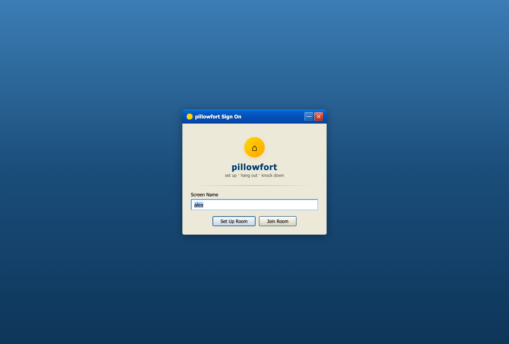
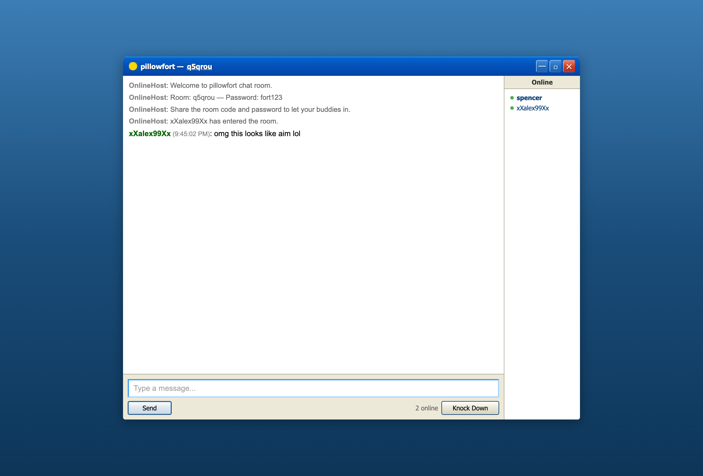

# pillowfort

Small, private, disposable chat rooms with AIM / Windows XP energy.

Set up a fort, share the code and password, hang out in real time, then knock it down. No accounts. No public room list. No durable chat history for late joiners.

<p align="center">
  
  
</p>

## What This Repo Contains

`pillowfort` is both:

- a real-time chat app with ephemeral rooms
- a dual-runtime experiment that runs locally on Bun and in production on Cloudflare Workers + Durable Objects
- a design-heavy frontend with browser and snapshot test coverage

The core product idea is simple:

1. Pick a screen name and secret password.
2. Create a fort and get an 8-character room code.
3. Share the code and password out of band.
4. Chat, doodle, and play small games together.
5. Knock the fort down, or let it expire.

When the fort is gone, the room is gone.

## Current Feature Set

### Core room behavior

- Invite-only rooms with no lobby and no room discovery
- Host-created forts with 8-character room codes
- Ephemeral room state with no user accounts
- Auto-suffixed duplicate names like `spencer2`
- Typing indicators
- Room-scoped presence with away messages
- Reconnect grace window for temporary disconnects
- Host migration via "the pillow throw" when the host leaves
- Rate limiting, guest cap, and idle room self-destruction

### Chat and UX

- AIM / Windows XP-inspired interface
- Desktop and mobile layouts
- Browser-side encrypted chat payloads using AES-GCM
- Message formatting support
- Save-chat export from the UI
- Invite-copy flow with room link + password

### Extras beyond plain chat

- Shared drawing canvas
- Pillow Fight vote-to-kick
- Rock Paper Scissors
- Tic-Tac-Toe
- Secret Saboteur
- King of the Hill
- Per-room leaderboards and queued game flow
- Host-paid Fort Pass path for custom codes, longer idle windows, and premium
  room themes

## Ephemeral Model

The app is designed to avoid long-lived room history:

- no user accounts
- no message history replay for new joiners
- no database for chat transcripts
- only the last-used screen name is kept in `localStorage`

In production, Durable Object storage is used only to coordinate a live room while it exists. When a fort is destroyed, that room state is cleared.

## Architecture

There are two server runtimes with roughly the same behavior:

| Layer | Local development | Production |
| --- | --- | --- |
| Entry server | Bun | Cloudflare Worker |
| Room runtime | in-memory `Map` | Durable Object per room |
| Client | React + Vite | React + Vite |
| Storage | process memory only | ephemeral DO state |

Important contributor note:

- local room behavior lives in `server.ts`
- production room behavior lives in `src/room.ts`
- shared validation, game, analytics, and alarm helpers live in `src/`

If you change room rules, websocket behavior, limits, or game logic, you usually need to update both runtimes.

For a deeper system-level walkthrough, see [ARCHITECTURE.md](ARCHITECTURE.md).

For a product, business, and project-lead analysis, see
[docs/PROJECT_LEAD_BRIEF.md](docs/PROJECT_LEAD_BRIEF.md).

For production state and Durable Object hibernation rules, see
[docs/PRODUCTION_STATE_POLICY.md](docs/PRODUCTION_STATE_POLICY.md).

For the beta measurement contract and privacy limits, see
[docs/BETA_ANALYTICS.md](docs/BETA_ANALYTICS.md).

For beta release steps, see
[docs/PUBLIC_BETA_DEPLOY_CHECKLIST.md](docs/PUBLIC_BETA_DEPLOY_CHECKLIST.md).

For the first revenue test, see
[docs/FIRST_PAID_SKU.md](docs/FIRST_PAID_SKU.md).

For paid beta support and refunds, see
[docs/FORT_PASS_SUPPORT_RUNBOOK.md](docs/FORT_PASS_SUPPORT_RUNBOOK.md).

For the current Stripe sandbox setup, see
[docs/STRIPE_TEST_SETUP.md](docs/STRIPE_TEST_SETUP.md).

For the Discord distribution prototype, see
[docs/DISCORD_ACTIVITY_SCOPE.md](docs/DISCORD_ACTIVITY_SCOPE.md).

Public API surfaces currently exposed by the app:

- `/ws?room=...` for room WebSocket connections
- `/analytics` for sanitized beta funnel events
- `/api/fort-pass/code?code=...` for custom-code availability checks
- `/api/fort-pass/checkout` for the paid checkout boundary; creates a Stripe
  Checkout Session only when `STRIPE_SECRET_KEY`, `FORT_PASS_PRICE_ID`, and
  `PUBLIC_BASE_URL` are configured
- `/api/stripe/webhook` for signed Stripe Checkout fulfillment; grants Fort
  Pass entitlements only after verified paid provider events
- `/?fort_pass=success&code=...&session_id=...` for accountless Fort Pass
  redemption after checkout

## Repo Layout

```text
pillowfort/
├── client/                React + Vite frontend
│   ├── src/
│   │   ├── screens/       Home, setup, join, chat, knocked-down screens
│   │   ├── components/    XP UI, chat UI, games, overlays, canvas
│   │   ├── stores/        Zustand app state
│   │   └── services/      websocket protocol, message handling, chat crypto
│   └── dist/              built assets served by Bun / Cloudflare
├── src/
│   ├── index.ts           Cloudflare Worker entrypoint
│   ├── room.ts            Durable Object room runtime
│   ├── shared.ts          shared limits and sanitizers
│   ├── game.ts            shared pure mini-game rules
│   ├── analytics.ts       privacy-safe analytics sanitization
│   ├── entitlements.ts    host-only paid SKU entitlement helpers
│   ├── routes.ts          shared internal and public route constants
│   ├── stripe.ts          Stripe checkout and webhook helpers
│   └── alarms.ts          Durable Object alarm schedule helpers
├── server.ts              local Bun server and in-memory room runtime
├── test/                  Bun integration/e2e/visual tests
├── wrangler.toml          Cloudflare config
└── ARCHITECTURE.md        protocol and runtime design notes
```

## Prerequisites

- Bun
- Node.js and npm
- A Cloudflare account only if you want to deploy

## Install

This repo is not set up as a workspace. Root and `client/` are separate package installs.

```bash
# root dependencies
npm install

# client dependencies
cd client
npm install
cd ..
```

## Running Locally

Build the frontend, then start the Bun server:

```bash
npm run build
npm run dev
```

Open `http://localhost:3000`.

What this does:

- `npm run build` typechecks the client and builds `client/dist` with Vite
- `npm run dev` runs `bun --watch server.ts`
- `server.ts` serves the built client and handles websocket room state in memory

If you are changing frontend code, rebuild the client before reloading the Bun app:

```bash
npm run build
```

There is also a client-only Vite script:

```bash
npm run dev:client
```

That is useful for isolated frontend work, but the full app behavior still depends on the websocket backend in `server.ts`.

## Testing

### Core test suite

```bash
npm test
```

This runs the stable core test suite:

- unit tests
- Worker entrypoint and Durable Object alarm tests
- room lifecycle / websocket integration tests
- gameplay protocol tests
- end-to-end invite flow checks

### Typecheck

```bash
npm run typecheck
```

This checks both runtime surfaces:

- `src/` against the Cloudflare Worker type environment
- `client/src/` against the browser React type environment

### Design snapshot tests only

```bash
npm run test:design-snapshots
```

This launches Playwright and captures key UI states. The first run writes baselines to `test/__snapshots__/design/`. Later runs compare against those baselines and fail when visual drift exceeds the configured threshold.

You can also point the snapshot runner at an existing app URL:

```bash
PF_BASE_URL=http://localhost:3000 npm run test:design-snapshots
```

### Long-form UI choreography tests

```bash
npm run test:ui
```

These Playwright-heavy suites mirror the demo and promo choreography flows. They are slower, more presentation-oriented, and kept separate from the default public-repo test run.

## Deployment

Use the root deploy script:

```bash
npm run deploy
```

That:

1. builds the client
2. deploys the Cloudflare Worker
3. publishes the Durable Object binding defined in `wrangler.toml`

Production routing looks like this:

- `/ws?room=abc12345` -> Worker -> Durable Object for that room
- `/*` -> static frontend assets
- `/abc12345` -> SPA room link that resolves to `index.html`

## Good First Places To Read

If you are trying to understand the app quickly, start here:

- [`server.ts`](server.ts) for the local runtime
- [`src/index.ts`](src/index.ts) for Cloudflare request routing
- [`src/room.ts`](src/room.ts) for production room behavior
- [`src/game.ts`](src/game.ts) for shared mini-game rule helpers
- [`src/analytics.ts`](src/analytics.ts) for privacy-safe analytics validation
- [`src/entitlements.ts`](src/entitlements.ts) for host-only paid SKU entitlement helpers
- [`src/alarms.ts`](src/alarms.ts) for production alarm scheduling helpers
- [`client/src/services/protocol.ts`](client/src/services/protocol.ts) for websocket message shapes
- [`client/src/stores/gameStore.ts`](client/src/stores/gameStore.ts) for client state
- [`client/src/screens/ChatScreen.tsx`](client/src/screens/ChatScreen.tsx) for the main UI surface
- [`test/integration.test.ts`](test/integration.test.ts) for expected room behavior
- [`test/worker.test.ts`](test/worker.test.ts) for Worker routing and Durable Object alarm behavior
- [`docs/PROJECT_LEAD_BRIEF.md`](docs/PROJECT_LEAD_BRIEF.md) for product strategy and monetization direction
- [`docs/PRODUCTION_STATE_POLICY.md`](docs/PRODUCTION_STATE_POLICY.md) for Durable Object state rules
- [`docs/BETA_ANALYTICS.md`](docs/BETA_ANALYTICS.md) for privacy-safe beta analytics
- [`docs/PUBLIC_BETA_DEPLOY_CHECKLIST.md`](docs/PUBLIC_BETA_DEPLOY_CHECKLIST.md) for public beta release steps
- [`docs/FIRST_PAID_SKU.md`](docs/FIRST_PAID_SKU.md) for the first host-only paid offer
- [`docs/DISCORD_ACTIVITY_SCOPE.md`](docs/DISCORD_ACTIVITY_SCOPE.md) for the Discord Activity prototype scope

## Status

This repo is beyond a toy chat mock. It already includes:

- two server runtimes
- reconnect and host handoff logic
- browser-side encrypted chat payloads
- room-scoped presence
- multiplayer mini-games
- integration tests
- visual regression coverage
- motion-design assets in a separate package

If you are making architectural changes, read `ARCHITECTURE.md` before editing the room runtime.
